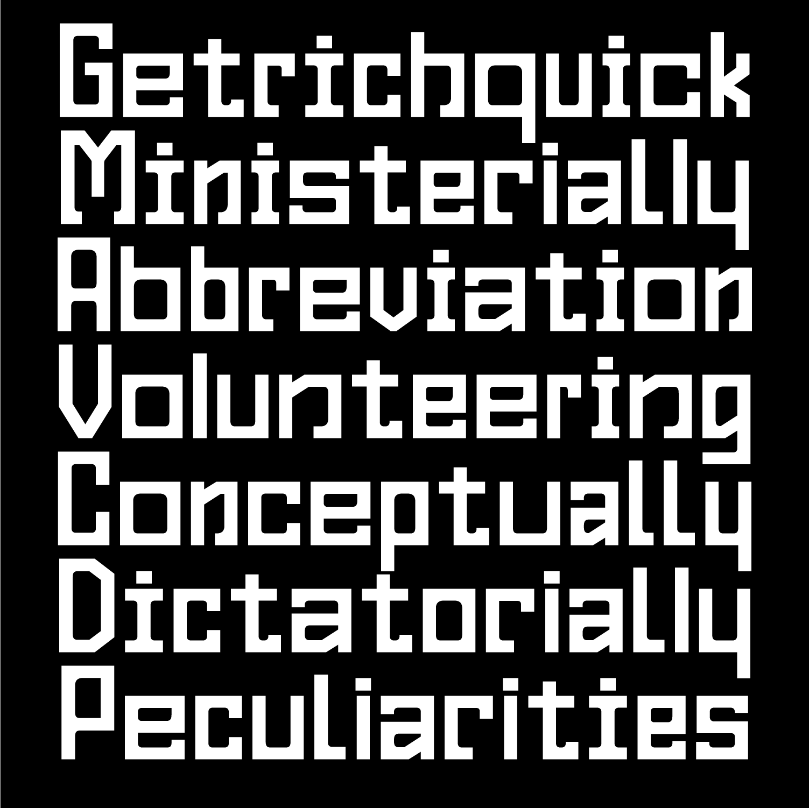
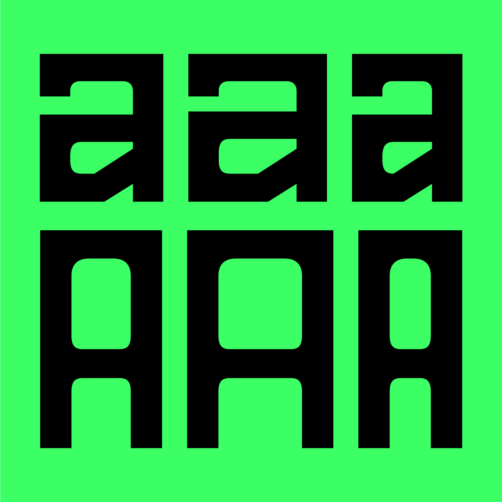
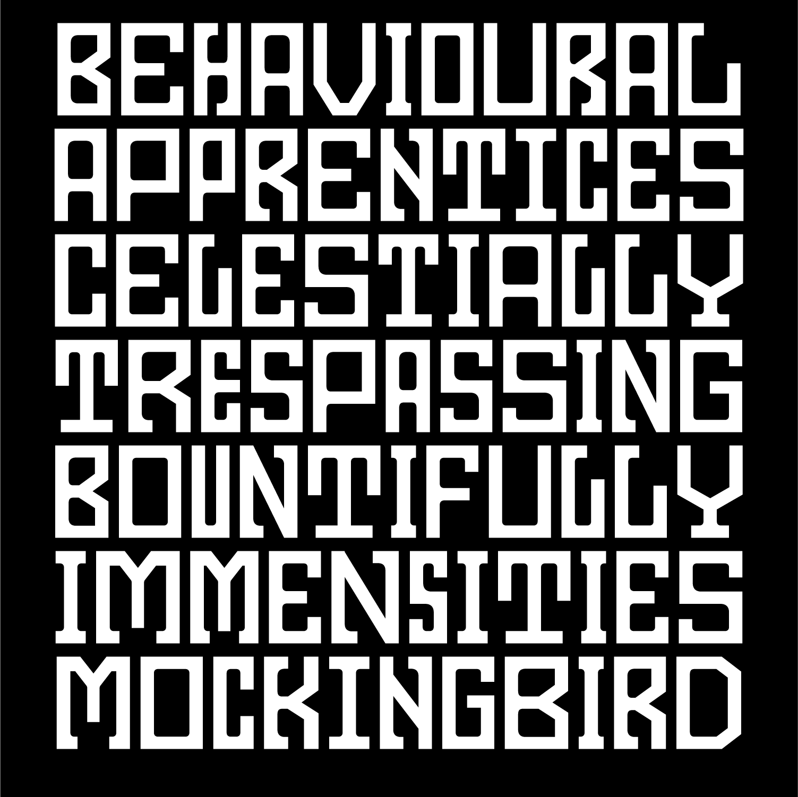

# Gest Open Typeface
## Designed by Maciej Połczyński
Released by [Laïc:Type](https://laic.pl) under SIL Open Font License [(OFL V. 1.1)](https://scripts.sil.org/cms/scripts/page.php?site_id=nrsi&id=ofl)

### Description
Gest (Polish for gesture, maybe album cover of Wish You Were Here by Pink Floyd?. Gesture, a good thing, a gift, a greeting). The typeface letterforms come from an unfinished logotype idea. Previously named "Eksces".

The outer geometrical construction is challenged by inner curves. The serifs are somehow randomly placed in the shapes to challenge the technical appearance.

Gest consists of 3 widths – Narrow, Regular and Wide. 
You can access individual widths via Stylistic Sets (OpenType features) or enjoy the mixture by using the Contextual Alternates feature.

The typeface consists of *Latin* script and 1430 glyphs in total.

To test the typeface and see specimen [have a look here](https://laic.pl/gest).

### Download
Fonts files available for us are located in the "Fonts" folder.
Production files are available in the "Source" folder.

#### Acknowledgment
The structure of files and the idea itself is inspired by [Velvetyne Type Foundry](https://www.velvetyne.fr/)

#### Images

